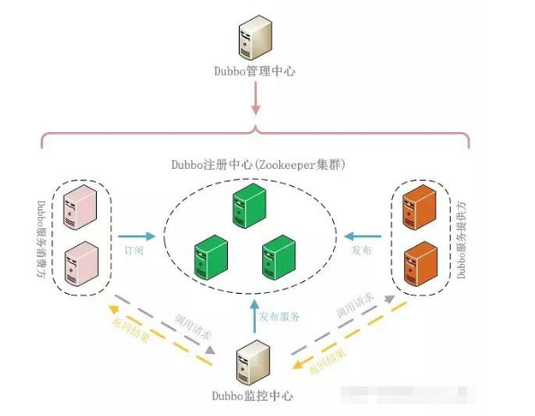
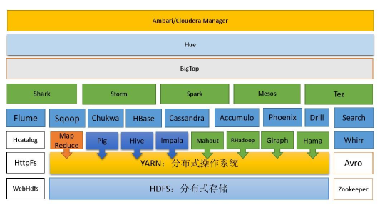
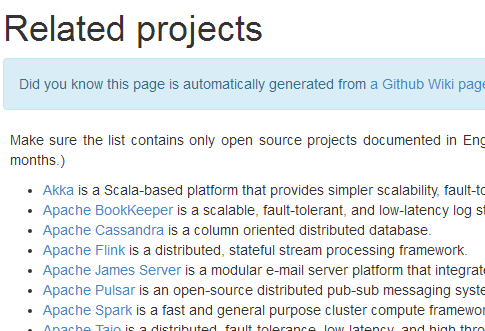

## 1.1 本课程学习要求

1. 本课程不适用于 `0` 基础的学员。
2. 要求已经掌握了 `Java` 编程，主要技术构成：`Java OOP` 编程、`Java` 多线程编程、`Java IO` 编程、`Java` 网络编程、常用的 `Java` 设计模式（比如观察者模式，命令模式，职责链模式）、常用的数据结构（比如链表）。
3. 本课程的《`Netty` 核心源码剖析章节》要求学员最好有项目开发和阅读源码的经历。

## 1.2 Netty 的介绍

1. `Netty` 是由 `JBOSS` 提供的一个 `Java` 开源框架，现为 `Github` 上的独立项目。
2. `Netty` 是一个异步的、基于事件驱动的网络应用框架，用以快速开发高性能、高可靠性的网络 `IO` 程序。
3. `Netty` 主要针对在 `TCP` 协议下，面向 `Client` 端的高并发应用，或者 `Peer-to-Peer` 场景下的大量数据持续传输的应用。
4. `Netty` 本质是一个 `NIO` 框架，适用于服务器通讯相关的多种应用场景。
5. 要透彻理解 `Netty`，需要先学习 `NIO`，这样我们才能阅读 `Netty` 的源码。

## 1.3 Netty 的应用场景

### 1.3.1 互联网行业

1. 互联网行业：在分布式系统中，各个节点之间需要远程服务调用，高性能的 `RPC` 框架必不可少，`Netty` 作为异步高性能的通信框架，往往作为基础通信组件被这些 `RPC` 框架使用。
2. 典型的应用有：阿里分布式服务框架 `Dubbo` 的 `RPC` 框 架使用 `Dubbo` 协议进行节点间通信，`Dubbo` 协议默认使用 `Netty` 作为基础通信组件，用于实现各进程节点之间的内部通信。

### 1.3.2 游戏行业

1. 无论是手游服务端还是大型的网络游戏，`Java` 语言得到了越来越广泛的应用。
2. `Netty` 作为高性能的基础通信组件，提供了 `TCP/UDP` 和 `HTTP` 协议栈，方便定制和开发私有协议栈，账号登录服务器。
3. 地图服务器之间可以方便的通过 `Netty` 进行高性能的通信。

 

### 1.3.3 大数据领域

1. 经典的 `Hadoop` 的高性能通信和序列化组件 `Avro` 的 `RPC` 框架，默认采用 `Netty` 进行跨界点通信。
2. 它的 `NettyService` 基于 `Netty` 框架二次封装实现。

### 1.3.4 其它开源项目使用到 Netty

网址：https://netty.io/wiki/related-projects.html

## 1.4 Netty 的学习资料参考

 