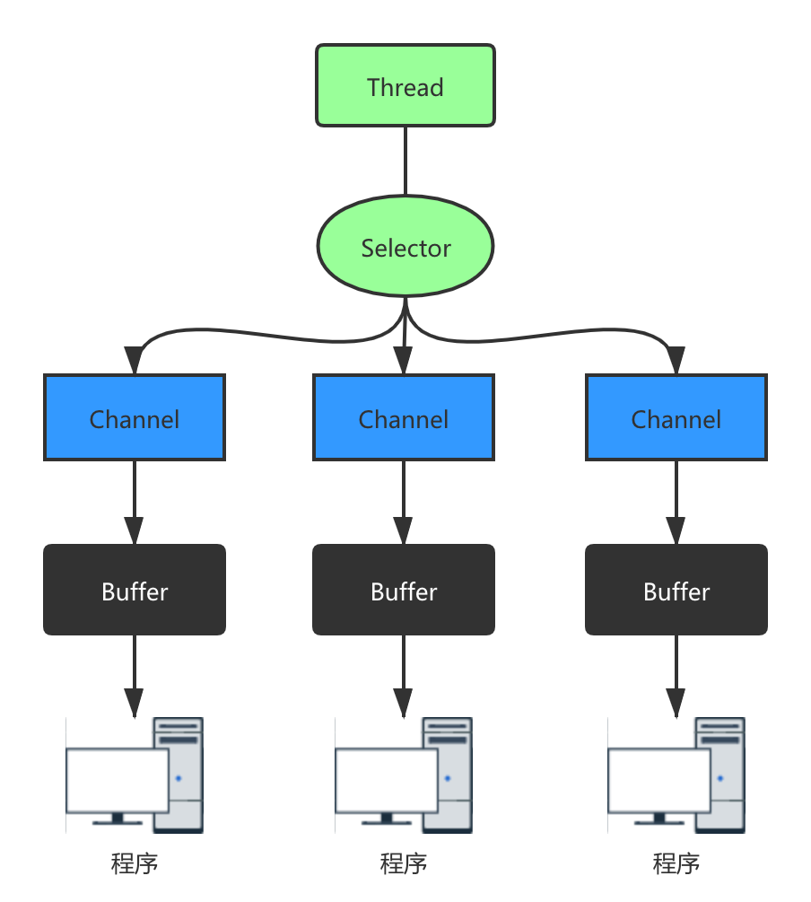
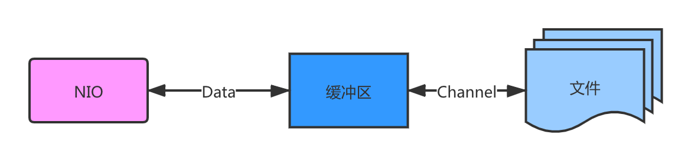
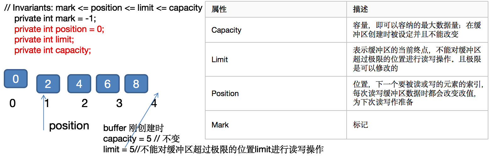
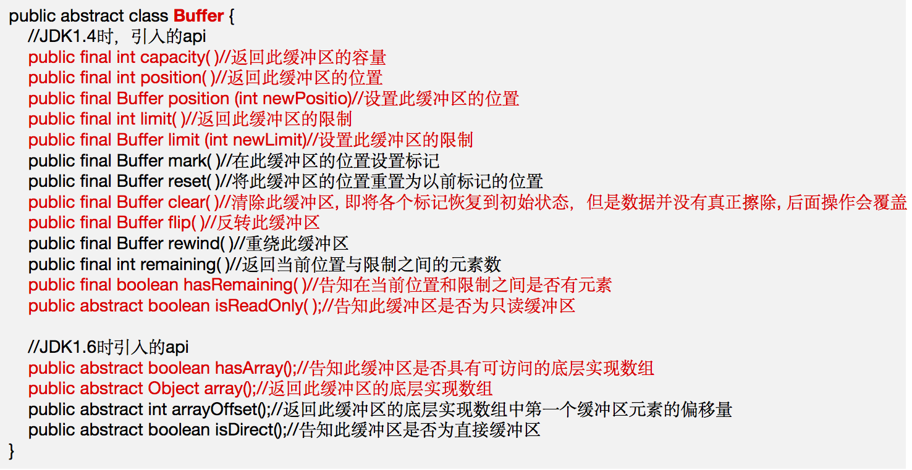
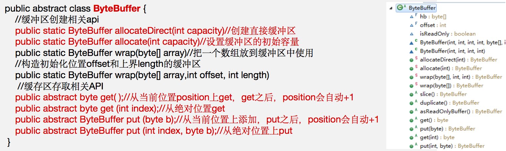
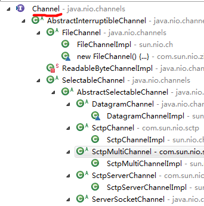
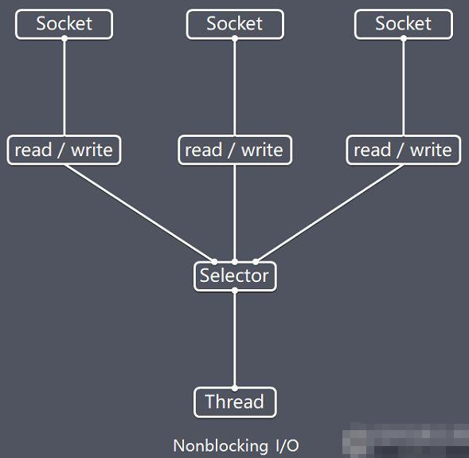

## 3.1 Java NIO 基本介绍

1. `Java NIO` 全称 **`Java non-blocking IO`**，是指 `JDK` 提供的新 `API`。从 `JDK1.4` 开始，`Java` 提供了一系列改进的输入/输出的新特性，被统称为 `NIO`（即 `NewIO`），是同步非阻塞的。
2. `NIO` 相关类都被放在 **`java.nio`** 包及子包下，并且对原 `java.io` 包中的很多类进行改写。【基本案例】
3. `NIO` 有三大核心部分：**`Channel`（通道）、`Buffer`（缓冲区）、`Selector`（选择器）**。
4. `NIO` 是**面向缓冲区，或者面向块编程**的。数据读取到一个它稍后处理的缓冲区，需要时可在缓冲区中前后移动，这就增加了处理过程中的灵活性，使用它可以提供非阻塞式的高伸缩性网络。
5. `Java NIO` 的非阻塞模式，使一个线程从某通道发送请求或者读取数据，但是它仅能得到目前可用的数据，如果目前没有数据可用时，就什么都不会获取，而不是保持线程阻塞，所以直至数据变的可以读取之前，该线程可以继续做其他的事情。非阻塞写也是如此，一个线程请求写入一些数据到某通道，但不需要等待它完全写入，这个线程同时可以去做别的事情。【后面有案例说明】
6. 通俗理解：`NIO` 是可以做到用一个线程来处理多个操作的。假设有 `10000` 个请求过来,根据实际情况，可以分配 `50` 或者 `100` 个线程来处理。不像之前的阻塞 `IO` 那样，非得分配 `10000` 个。
7. `HTTP 2.0` 使用了多路复用的技术，做到同一个连接并发处理多个请求，而且并发请求的数量比 `HTTP 1.1` 大了好几个数量级。
8. 案例说明 `NIO` 的 `Buffer`

```java
package com.atguigu.nio;

import java.nio.IntBuffer;

public class BasicBuffer {

    public static void main(String[] args) {

        //举例说明 Buffer 的使用(简单说明)
        //创建一个 Buffer，大小为 5，即可以存放 5 个 int
        IntBuffer intBuffer = IntBuffer.allocate(5);

        //向buffer存放数据
        //intBuffer.put(10);
        //intBuffer.put(11);
        //intBuffer.put(12);
        //intBuffer.put(13);
        //intBuffer.put(14);
        for (int i = 0; i < intBuffer.capacity(); i++) {
            intBuffer.put(i * 2);
        }
        //如何从 buffer 读取数据
        //将 buffer 转换，读写切换(!!!)
        intBuffer.flip();
        while (intBuffer.hasRemaining()) {
            System.out.println(intBuffer.get());
        }
    }
}
```

## 3.2 NIO 和 BIO 的比较

1. `BIO` 以流的方式处理数据，而 `NIO` 以块的方式处理数据，块 `I/O` 的效率比流 `I/O` 高很多。
2. `BIO` 是阻塞的，`NIO` 则是非阻塞的。
3. `BIO` 基于字节流和字符流进行操作，而 `NIO` 基于 `Channel`（通道）和 `Buffer`（缓冲区）进行操作，数据总是从通道读取到缓冲区中，或者从缓冲区写入到通道中。`Selector`（选择器）用于监听多个通道的事件（比如：连接请求，数据到达等），因此使用单个线程就可以监听多个客户端通道。

## 3.3 NIO 三大核心原理示意图

一张图描述 `NIO` 的 `Selector`、`Channel` 和 `Buffer` 的关系。

### 3.3.1 Selector、Channel 和 Buffer 关系图（简单版）

关系图的说明:

<!-- ) -->


1. 每个 `Channel` 都会对应一个 `Buffer`。
2. `Selector` 对应一个线程，一个线程对应多个 `Channel`（连接）。
3. 该图反应了有三个 `Channel` 注册到该 `Selector` //程序
4. 程序切换到哪个 `Channel` 是由事件决定的，`Event` 就是一个重要的概念。
5. `Selector` 会根据不同的事件，在各个通道上切换。
6. `Buffer` 就是一个内存块，底层是有一个数组。
7. 数据的读取写入是通过 `Buffer`，这个和 `BIO`，`BIO` 中要么是输入流，或者是输出流，不能双向，但是 `NIO` 的 `Buffer` 是可以读也可以写，需要 `flip` 方法切换 `Channel` 是双向的，可以返回底层操作系统的情况，比如 `Linux`，底层的操作系统通道就是双向的。

## 3.4 缓冲区（Buffer）

### 3.4.1 基本介绍

缓冲区（`Buffer`）：缓冲区本质上是一个**可以读写数据的内存块**，可以理解成是一个**容器对象（含数组）**，该对象提供了一组方法，可以更轻松地使用内存块，，缓冲区对象内置了一些机制，能够跟踪和记录缓冲区的状态变化情况。`Channel` 提供从文件、网络读取数据的渠道，但是读取或写入的数据都必须经由 `Buffer`，如图:【后面举例说明】



### 3.4.2 Buffer 类及其子类

1. 在 `NIO` 中，`Buffer` 是一个顶层父类，它是一个抽象类，类的层级关系图：

 

2. `Buffer` 类定义了所有的缓冲区都具有的四个属性来提供关于其所包含的数据元素的信息：



3. `Buffer` 类相关方法一览



### 3.4.3 ByteBuffer

从前面可以看出对于 `Java` 中的基本数据类型（`boolean` 除外），都有一个 `Buffer` 类型与之相对应，最常用的自然是 `ByteBuffer` 类（二进制数据），该类的主要方法如下：



## 3.5 通道（Channel）

## 3.6 基本介绍

1. `NIO` 的通道类似于流，但有些区别如下：
   - 通道可以同时进行读写，而流只能读或者只能写
   - 通道可以实现异步读写数据
   - 通道可以从缓冲读数据，也可以写数据到缓冲:
2. `BIO` 中的 `Stream` 是单向的，例如 `FileInputStream` 对象只能进行读取数据的操作，而 `NIO` 中的通道（`Channel`）是双向的，可以读操作，也可以写操作。
3. `Channel` 在 `NIO` 中是一个接口 `public interface Channel extends Closeable{}`
4. 常用的 `Channel` 类有：**`FileChannel`、`DatagramChannel`、`ServerSocketChannel` 和 `SocketChannel`**。【`ServerSocketChanne` 类似 `ServerSocket`、`SocketChannel` 类似 `Socket`】
5. `FileChannel` 用于文件的数据读写，`DatagramChannel` 用于 `UDP` 的数据读写，`ServerSocketChannel` 和 `SocketChannel` 用于 `TCP` 的数据读写。
6. 图示



### 3.6.1 FileChannel 类

`FileChannel` 主要用来对本地文件进行 `IO` 操作，常见的方法有

- `public int read(ByteBuffer dst)`，从通道读取数据并放到缓冲区中
- `public int write(ByteBuffer src)`，把缓冲区的数据写到通道中
- `public long transferFrom(ReadableByteChannel src, long position, long count)`，从目标通道中复制数据到当前通道
- `public long transferTo(long position, long count, WritableByteChannel target)`，把数据从当前通道复制给目标通道

### 3.6.2 应用实例1 - 本地文件写数据

实例要求：

1. 使用前面学习后的 `ByteBuffer`（缓冲）和 `FileChannel`（通道），将 "hello,尚硅谷" 写入到 `file01.txt` 中
2. 文件不存在就创建
3. 代码演示

```java
package com.atguigu.nio;

import java.io.FileOutputStream;
import java.nio.ByteBuffer;
import java.nio.channels.FileChannel;

public class NIOFileChannel01 {

    public static void main(String[] args) throws Exception {
        String str = "hello,尚硅谷";
        //创建一个输出流->channel
        FileOutputStream fileOutputStream = new FileOutputStream("d:\\file01.txt");

        //通过 fileOutputStream 获取对应的 FileChannel
        //这个 fileChannel 真实类型是 FileChannelImpl
        FileChannel fileChannel = fileOutputStream.getChannel();

        //创建一个缓冲区ByteBuffer
        ByteBuffer byteBuffer = ByteBuffer.allocate(1024);

        //将str放入byteBuffer
        byteBuffer.put(str.getBytes());

        //对byteBuffer进行flip
        byteBuffer.flip();

        //将 byteBuffer 数据写入到 fileChannel
        fileChannel.write(byteBuffer);
        fileOutputStream.close();
    }
}
```

### 3.6.3 应用实例2 - 本地文件读数据

实例要求：

1. 使用前面学习后的 `ByteBuffer`（缓冲）和 `FileChannel`（通道），将 `file01.txt` 中的数据读入到程序，并显示在控制台屏幕
2. 假定文件已经存在
3. 代码演示

```java
package com.atguigu.nio;

import java.io.File;
import java.io.FileInputStream;
import java.nio.ByteBuffer;
import java.nio.channels.FileChannel;

public class NIOFileChannel02 {

    public static void main(String[] args) throws Exception {

        //创建文件的输入流
        File file = new File("d:\\file01.txt");
        FileInputStream fileInputStream = new FileInputStream(file);
        
        //通过 fileInputStream 获取对应的 FileChannel -> 实际类型 FileChannelImpl
        FileChannel fileChannel = fileInputStream.getChannel();
        
        //创建缓冲区
        ByteBuffer byteBuffer = ByteBuffer.allocate((int)file.length());
        
        //将通道的数据读入到 Buffer
        fileChannel.read(byteBuffer);
        
        //将 byteBuffer 的字节数据转成 String
        System.out.println(new String(byteBuffer.array()));
        fileInputStream.close();
    }
}
```

### 3.6.4 应用实例3 - 使用一个 Buffer 完成文件读取、写入

实例要求：

1. 使用 `FileChannel`（通道）和方法 `read、write`，完成文件的拷贝
2. 拷贝一个文本文件 `1.txt`，放在项目下即可
3. 代码演示


```java
package com.atguigu.nio;

import java.io.FileInputStream;
import java.io.FileOutputStream;
import java.nio.ByteBuffer;
import java.nio.channels.FileChannel;

public class NIOFileChannel03 {

    public static void main(String[] args) throws Exception {

        FileInputStream fileInputStream = new FileInputStream("1.txt");
        FileChannel fileChannel01 = fileInputStream.getChannel();
        FileOutputStream fileOutputStream = new FileOutputStream("2.txt");
        FileChannel fileChannel02 = fileOutputStream.getChannel();

        ByteBuffer byteBuffer = ByteBuffer.allocate(512);
        
        while (true) { //循环读取

            //这里有一个重要的操作，一定不要忘了
            /*
            public final Buffer clear() {
                position = 0;
                limit = capacity;
                mark = -1;
                return this;
            }
            */
            byteBuffer.clear(); //清空 buffer
            int read = fileChannel01.read(byteBuffer);
            System.out.println("read = " + read);
            if (read == -1) { //表示读完
                break;
            }

            //将 buffer 中的数据写入到 fileChannel02--2.txt
            byteBuffer.flip();
            fileChannel02.write(byteBuffer);
        }

        //关闭相关的流
        fileInputStream.close();
        fileOutputStream.close();
    }
}
```

### 3.6.5 应用实例4 - 拷贝文件 transferFrom 方法

1. 实例要求：
2. 使用 `FileChannel`（通道）和方法 `transferFrom`，完成文件的拷贝
3. 拷贝一张图片
4. 代码演示

```java
package com.atguigu.nio;

import java.io.FileInputStream;
import java.io.FileOutputStream;
import java.nio.channels.FileChannel;

public class NIOFileChannel04 {

    public static void main(String[] args) throws Exception {

        //创建相关流
        FileInputStream fileInputStream = new FileInputStream("d:\\a.jpg");
        FileOutputStream fileOutputStream = new FileOutputStream("d:\\a2.jpg");
        
        //获取各个流对应的 FileChannel
        FileChannel sourceCh = fileInputStream.getChannel();
        FileChannel destCh = fileOutputStream.getChannel();

        //使用 transferForm 完成拷贝
        destCh.transferFrom(sourceCh, 0, sourceCh.size());

        //关闭相关通道和流
        sourceCh.close();
        destCh.close();
        fileInputStream.close();
        fileOutputStream.close();
    }
}
```

### 3.6.6 关于 Buffer 和 Channel 的注意事项和细节

1. `ByteBuffer` 支持类型化的 `put` 和 `get`，`put` 放入的是什么数据类型，`get` 就应该使用相应的数据类型来取出，否则可能有 `BufferUnderflowException` 异常。【举例说明】

```java
package com.atguigu.nio;

import java.nio.ByteBuffer;

public class NIOByteBufferPutGet {

    public static void main(String[] args) {
        
        //创建一个 Buffer
        ByteBuffer buffer = ByteBuffer.allocate(64);

        //类型化方式放入数据
        buffer.putInt(100);
        buffer.putLong(9);
        buffer.putChar('尚');
        buffer.putShort((short) 4);

        //取出
        buffer.flip();
        
        System.out.println();
        
        System.out.println(buffer.getInt());
        System.out.println(buffer.getLong());
        System.out.println(buffer.getChar());
        System.out.println(buffer.getShort());
    }
}
```

2. 可以将一个普通 `Buffer` 转成只读 `Buffer`【举例说明】

```java
package com.atguigu.nio;

import java.nio.ByteBuffer;

public class ReadOnlyBuffer {

    public static void main(String[] args) {

        //创建一个 buffer
        ByteBuffer buffer = ByteBuffer.allocate(64);

        for (int i = 0; i < 64; i++) {
            buffer.put((byte) i);
        }

        //读取
        buffer.flip();

        //得到一个只读的 Buffer
        ByteBuffer readOnlyBuffer = buffer.asReadOnlyBuffer();
        System.out.println(readOnlyBuffer.getClass());

        //读取
        while (readOnlyBuffer.hasRemaining()) {
            System.out.println(readOnlyBuffer.get());
        }

        readOnlyBuffer.put((byte) 100); //ReadOnlyBufferException
    }
}
```

3. `NIO` 还提供了 `MappedByteBuffer`，可以让文件直接在内存（堆外的内存）中进行修改，而如何同步到文件由 `NIO` 来完成。【举例说明】

```java
package com.atguigu.nio;

import java.io.RandomAccessFile;
import java.nio.MappedByteBuffer;
import java.nio.channels.FileChannel;

/**
 * 说明 1.MappedByteBuffer 可让文件直接在内存（堆外内存）修改,操作系统不需要拷贝一次
 */
public class MappedByteBufferTest {

    public static void main(String[] args) throws Exception {

        RandomAccessFile randomAccessFile = new RandomAccessFile("1.txt", "rw");
        //获取对应的通道
        FileChannel channel = randomAccessFile.getChannel();

        /**
         * 参数 1:FileChannel.MapMode.READ_WRITE 使用的读写模式
         * 参数 2：0：可以直接修改的起始位置
         * 参数 3:5: 是映射到内存的大小（不是索引位置），即将 1.txt 的多少个字节映射到内存
         * 可以直接修改的范围就是 0-5
         * 实际类型 DirectByteBuffer
         */
        MappedByteBuffer mappedByteBuffer = channel.map(FileChannel.MapMode.READ_WRITE, 0, 5);

        mappedByteBuffer.put(0, (byte) 'H');
        mappedByteBuffer.put(3, (byte) '9');
        mappedByteBuffer.put(5, (byte) 'Y');//IndexOutOfBoundsException

        randomAccessFile.close();
        System.out.println("修改成功~~");
    }
}
```

4. 前面我们讲的读写操作，都是通过一个 `Buffer` 完成的，`NIO` 还支持通过多个 `Buffer`（即 `Buffer`数组）完成读写操作，即 `Scattering` 和 `Gathering`【举例说明】

```java
package com.atguigu.nio;

import java.net.InetSocketAddress;
import java.nio.ByteBuffer;
import java.nio.channels.ServerSocketChannel;
import java.nio.channels.SocketChannel;
import java.util.Arrays;

/**
 * Scattering：将数据写入到 buffer 时，可以采用 buffer 数组，依次写入 [分散]
 * Gathering：从 buffer 读取数据时，可以采用 buffer 数组，依次读
 */
public class ScatteringAndGatheringTest {

    public static void main(String[] args) throws Exception {
        
        //使用 ServerSocketChannel 和 SocketChannel 网络
        ServerSocketChannel serverSocketChannel = ServerSocketChannel.open();
        InetSocketAddress inetSocketAddress = new InetSocketAddress(7000);

        //绑定端口到 socket，并启动
        serverSocketChannel.socket().bind(inetSocketAddress);

        //创建 buffer 数组
        ByteBuffer[] byteBuffers = new ByteBuffer[2];
        byteBuffers[0] = ByteBuffer.allocate(5);
        byteBuffers[1] = ByteBuffer.allocate(3);

        //等客户端连接 (telnet)
        SocketChannel socketChannel = serverSocketChannel.accept();

        int messageLength = 8; //假定从客户端接收 8 个字节

        //循环的读取
        while (true) {
            int byteRead = 0;

            while (byteRead < messageLength) {
                long l = socketChannel.read(byteBuffers);
                byteRead += 1; //累计读取的字节数
                System.out.println("byteRead = " + byteRead);
                //使用流打印,看看当前的这个 buffer 的 position 和 limit
                Arrays.asList(byteBuffers).stream().map(buffer -> "position = " + buffer.position() + ", limit = " + buffer.limit()).forEach(System.out::println);
            }

            //将所有的 buffer 进行 flip
            Arrays.asList(byteBuffers).forEach(buffer -> buffer.flip());
            //将数据读出显示到客户端
            long byteWirte = 0;
            while (byteWirte < messageLength) {
                long l = socketChannel.write(byteBuffers);//
                byteWirte += l;
            }
            
            //将所有的buffer进行clear
            Arrays.asList(byteBuffers).forEach(buffer -> {
                buffer.clear();
            });
            
            System.out.println("byteRead = " + byteRead + ", byteWrite = " + byteWirte + ", messagelength = " + messageLength);
        }
    }
}
```

## 3.7 Selector（选择器）

### 3.7.1 基本介绍

1. `Java` 的 `NIO`，用非阻塞的 `IO` 方式。可以用一个线程，处理多个的客户端连接，就会使用到 `Selector`（选择器）。
2. `Selector` 能够检测多个注册的通道上是否有事件发生（注意：多个 `Channel` 以事件的方式可以注册到同一个 `Selector`），如果有事件发生，便获取事件然后针对每个事件进行相应的处理。这样就可以只用一个单线程去管理多个通道，也就是管理多个连接和请求。【示意图】
3. 只有在连接/通道真正有读写事件发生时，才会进行读写，就大大地减少了系统开销，并且不必为每个连接都创建一个线程，不用去维护多个线程。
4. 避免了多线程之间的上下文切换导致的开销。

### 3.7.2 Selector 示意图和特点说明



说明如下：

1. `Netty` 的 `IO` 线程 `NioEventLoop` 聚合了 `Selector`（选择器，也叫多路复用器），可以同时并发处理成百上千个客户端连接。
2. 当线程从某客户端 `Socket` 通道进行读写数据时，若没有数据可用时，该线程可以进行其他任务。
3. 线程通常将非阻塞 `IO` 的空闲时间用于在其他通道上执行 `IO` 操作，所以单独的线程可以管理多个输入和输出通道。
4. 由于读写操作都是非阻塞的，这就可以充分提升 `IO` 线程的运行效率，避免由于频繁 `I/O` 阻塞导致的线程挂起。
5. 一个 `I/O` 线程可以并发处理 `N` 个客户端连接和读写操作，这从根本上解决了传统同步阻塞 `I/O` 一连接一线程模型，架构的性能、弹性伸缩能力和可靠性都得到了极大的提升。

### 3.7.3 Selector 类相关方法


### 3.7.4 注意事项

1. `NIO` 中的 `ServerSocketChannel` 功能类似 `ServerSocket`、`SocketChannel` 功能类似 `Socket`。
2. `Selector` 相关方法说明
   - `selector.select();` //阻塞
   - `selector.select(1000);` //阻塞 1000 毫秒，在 1000 毫秒后返回
   - `selector.wakeup();` //唤醒 selector
   - `selector.selectNow();` //不阻塞，立马返还

## 3.8 NIO 非阻塞网络编程原理分析图

`NIO` 非阻塞网络编程相关的（`Selector`、`SelectionKey`、`ServerScoketChannel` 和 `SocketChannel`）关系梳理图

对上图的说明：

1. 当客户端连接时，会通过 `ServerSocketChannel` 得到 `SocketChannel`。
2. `Selector` 进行监听 `select` 方法，返回有事件发生的通道的个数。
3. 将 `socketChannel` 注册到 `Selector` 上，`register(Selector sel, int ops)`，一个 `Selector` 上可以注册多个 `SocketChannel`。
4. 注册后返回一个 `SelectionKey`，会和该 `Selector` 关联（集合）。
5. 进一步得到各个 `SelectionKey`（有事件发生）。
6. 在通过 `SelectionKey` 反向获取 `SocketChannel`，方法 `channel()`。
7. 可以通过得到的 `channel`，完成业务处理。
8. 代码撑腰。。。

## 3.9 NIO 非阻塞网络编程快速入门

案例要求：

1. 编写一个 `NIO` 入门案例，实现服务器端和客户端之间的数据简单通讯（非阻塞）
2. 目的：理解 `NIO` 非阻塞网络编程机制
3. 看老师代码演示

## 3.10 SelectionKey

## 3.11 ServerSocketChannel

## 3.12 SocketChannel

## 3.13 NIO 网络编程应用实例 - 群聊系统

## 3.14 NIO 与零拷贝

### 3.14.1 零拷贝基本介绍

### 3.14.2 传统 IO 数据读写

### 3.14.3 传统 IO 模型

### 3.14.4 mmap 优化

### 3.14.5 sendFile 优化

### 3.14.6 零拷贝的再次理解

### 3.14.7 mmap 和 sendFile 的区别

### 3.14.8 NIO 零拷贝案例

## 3.15 Java AIO 基本介绍

## 3.16 BIO、NIO、AIO 对比表
