## 5.1 线程模型基本介绍

1. 不同的线程模式，对程序的性能有很大影响，为了搞清 `Netty` 线程模式，我们来系统的讲解下各个线程模式，最后看看 `Netty` 线程模型有什么优越性。
2. 目前存在的线程模型有：传统阻塞 `I/O` 服务模型 `Reactor` 模式
3. 根据 `Reactor` 的数量和处理资源池线程的数量不同，有 `3` 种典型的实现单 `Reactor` 单线程；单 `Reactor`多线程；主从 `Reactor`多线程
4. `Netty` 线程模式（`Netty` 主要基于主从 `Reactor` 多线程模型做了一定的改进，其中主从 `Reactor` 多线程模型有多个 `Reactor`）

## 5.2 传统阻塞 I/O 服务模型

### 5.2.1 工作原理图

1. 黄色的框表示对象，蓝色的框表示线程
2. 白色的框表示方法（`API`）

### 5.2.2 模型特点

1. 采用阻塞 `IO` 模式获取输入的数据
2. 每个连接都需要独立的线程完成数据的输入，业务处理，数据返回

### 5.2.3 问题分析

1. 当并发数很大，就会创建大量的线程，占用很大系统资源
2. 连接创建后，如果当前线程暂时没有数据可读，该线程会阻塞在 `read` 操作，造成线程资源浪费

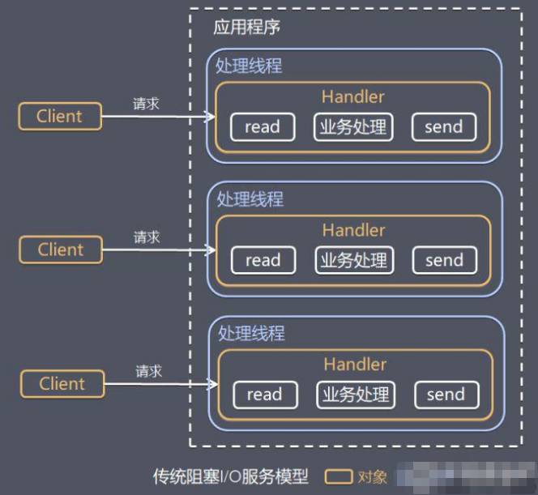

## 5.3 Reactor 模式

### 5.3.1 针对传统阻塞 I/O 服务模型的 2 个缺点，解决方案：

1. 基于 `I/O` 复用模型：多个连接共用一个阻塞对象，应用程序只需要在一个阻塞对象等待，无需阻塞等待所有连接。当某个连接有新的数据可以处理时，操作系统通知应用程序，线程从阻塞状态返回，开始进行业务处理 `Reactor` 对应的叫法：
   1. 反应器模式 
   2. 分发者模式（Dispatcher）
   3. 通知者模式（notifier）

2. 基于线程池复用线程资源：不必再为每个连接创建线程，将连接完成后的业务处理任务分配给线程进行处理，一个线程可以处理多个连接的业务。

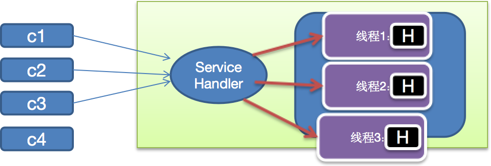

### 5.3.2 I/O 复用结合线程池，就是 Reactor 模式基本设计思想，如图

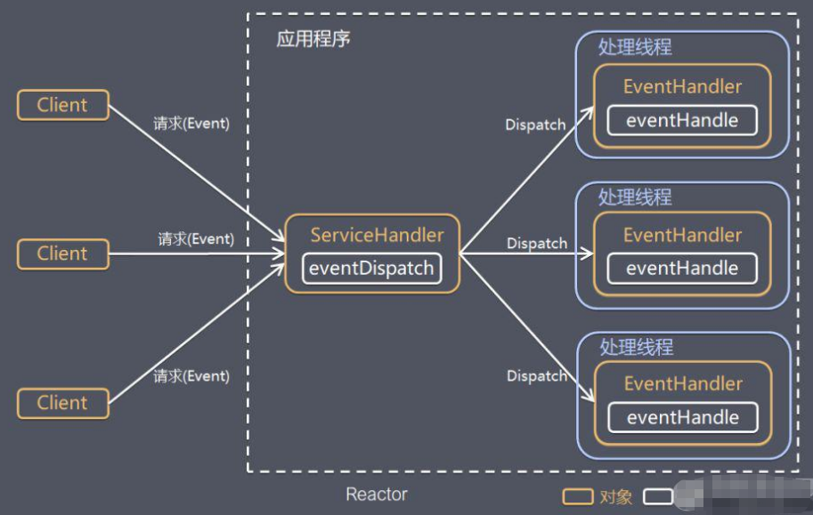

对上图说明：

1. `Reactor` 模式，通过一个或多个输入同时传递给服务处理器的模式（基于事件驱动）
2. 服务器端程序处理传入的多个请求,并将它们同步分派到相应的处理线程，因此 `Reactor` 模式也叫 `Dispatcher` 模式
3. `Reactor` 模式使用 `IO` 复用监听事件，收到事件后，分发给某个线程（进程），这点就是网络服务器高并发处理关键

### 5.3.3 Reactor 模式中核心组成

1. `Reactor`：`Reactor` 在一个单独的线程中运行，负责监听和分发事件，分发给适当的处理程序来对 `IO` 事件做出反应。它就像公司的电话接线员，它接听来自客户的电话并将线路转移到适当的联系人；
2. `Handlers`：处理程序执行 `I/O` 事件要完成的实际事件，类似于客户想要与之交谈的公司中的实际官员。`Reactor` 通过调度适当的处理程序来响应 `I/O` 事件，处理程序执行非阻塞操作。

### 5.3.4 Reactor 模式分类

根据 `Reactor` 的数量和处理资源池线程的数量不同，有 `3` 种典型的实现

1. 单 `Reactor` 单线程
2. 单 `Reactor` 多线程
3. 主从 `Reactor` 多线程

## 5.4 单 Reactor 单线程

原理图，并使用 `NIO` 群聊系统验证

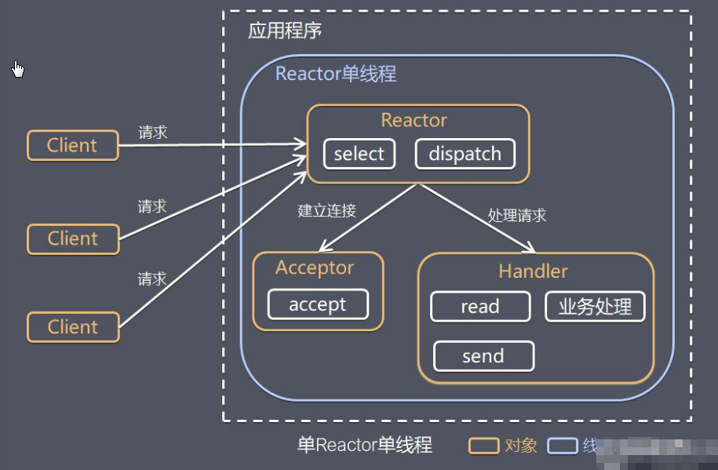

### 5.4.1 方案说明

1. `Select` 是前面 `I/O` 复用模型介绍的标准网络编程 `API`，可以实现应用程序通过一个阻塞对象监听多路连接请求
2. `Reactor` 对象通过 `Select` 监控客户端请求事件，收到事件后通过 `Dispatch` 进行分发
3. 如果是建立连接请求事件，则由 `Acceptor` 通过 `Accept` 处理连接请求，然后创建一个 `Handler` 对象处理连接完成后的后续业务处理
4. 如果不是建立连接事件，则 `Reactor` 会分发调用连接对应的 `Handler` 来响应
5. `Handler` 会完成 `Read` → 业务处理 → `Send` 的完整业务流程

结合实例：服务器端用一个线程通过多路复用搞定所有的 `IO` 操作（包括连接，读、写等），编码简单，清晰明了，但是如果客户端连接数量较多，将无法支撑，前面的 `NIO` 案例就属于这种模型。

### 5.4.2 方案优缺点分析

1. 优点：模型简单，没有多线程、进程通信、竞争的问题，全部都在一个线程中完成
2. 缺点：性能问题，只有一个线程，无法完全发挥多核 `CPU` 的性能。`Handler`在处理某个连接上的业务时，整个进程无法处理其他连接事件，很容易导致性能瓶颈
3. 缺点：可靠性问题，线程意外终止，或者进入死循环，会导致整个系统通信模块不可用，不能接收和处理外部消息，造成节点故障
4. 使用场景：客户端的数量有限，业务处理非常快速，比如 `Redis` 在业务处理的时间复杂度 `O(1)` 的情况

## 5.5 单 Reactor 多线程

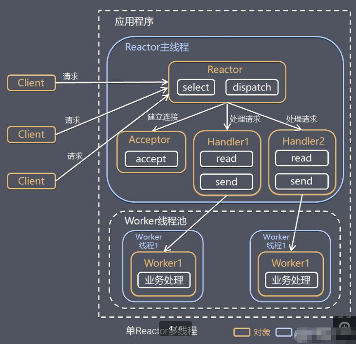

### 5.5.1 原理图

### 5.5.2 对上图的小结

1. `Reactor` 对象通过 `Select` 监控客户端请求事件，收到事件后，通过 `Dispatch` 进行分发
2. 如果建立连接请求，则右 `Acceptor` 通过 `accept` 处理连接请求，然后创建一个 `Handler` 对象处理完成连接后的各种事件
3. 如果不是连接请求，则由 `Reactor` 分发调用连接对应的 `handler` 来处理
4. `handler` 只负责响应事件，不做具体的业务处理，通过 `read` 读取数据后，会分发给后面的 `worker` 线程池的某个线程处理业务
5. `worker` 线程池会分配独立线程完成真正的业务，并将结果返回给 `handler`
6. `handler` 收到响应后，通过 `send` 将结果返回给 `client`


### 5.5.3 方案优缺点分析

1. 优点：可以充分的利用多核 `cpu` 的处理能力
2. 缺点：多线程数据共享和访问比较复杂，`Reactor` 处理所有的事件的监听和响应，在单线程运行，在高并发场景容易出现性能瓶颈。

## 5.6 主从 Reactor 多线程

### 5.6.1 工作原理图

针对单 `Reactor` 多线程模型中，`Reactor` 在单线程中运行，高并发场景下容易成为性能瓶颈，可以让 `Reactor` 在多线程中运行

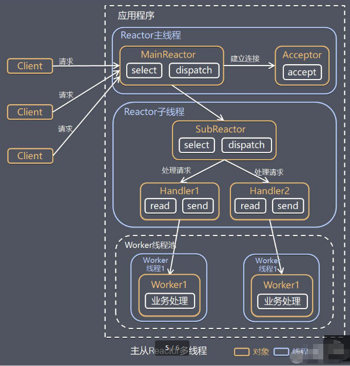

### 5.6.2 上图的方案说明

1. `Reactor` 主线程 `MainReactor` 对象通过 `select` 监听连接事件，收到事件后，通过 `Acceptor` 处理连接事件
2. 当 `Acceptor` 处理连接事件后，`MainReactor` 将连接分配给 `SubReactor`
3. `subreactor` 将连接加入到连接队列进行监听，并创建 `handler` 进行各种事件处理
4. 当有新事件发生时，`subreactor` 就会调用对应的 `handler` 处理
5. `handler` 通过 `read` 读取数据，分发给后面的 `worker` 线程处理
6. `worker` 线程池分配独立的 `worker` 线程进行业务处理，并返回结果
7. `handler` 收到响应的结果后，再通过 `send` 将结果返回给 `client` 
8. `Reactor` 主线程可以对应多个 `Reactor` 子线程，即 `MainRecator` 可以关联多个 `SubReactor`

### 5.6.3 Scalable IO in Java 对 Multiple Reactors 的原理图解：

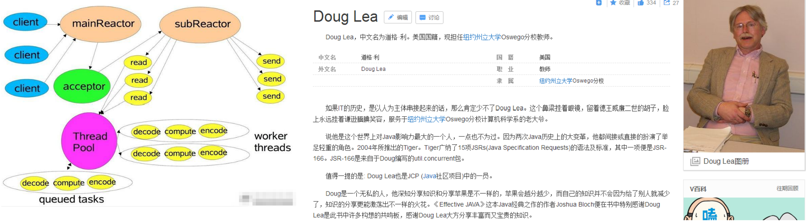

### 5.6.4 方案优缺点说明

1. 优点：父线程与子线程的数据交互简单职责明确，父线程只需要接收新连接，子线程完成后续的业务处理。
2. 优点：父线程与子线程的数据交互简单，`Reactor` 主线程只需要把新连接传给子线程，子线程无需返回数据。
3. 缺点：编程复杂度较高
4. 结合实例：这种模型在许多项目中广泛使用，包括 `Nginx` 主从 `Reactor` 多进程模型，`Memcached` 主从多线程，`Netty` 主从多线程模型的支持

## 5.7 Reactor 模式小结

### 5.7.1 3 种模式用生活案例来理解

1. 单 `Reactor` 单线程，前台接待员和服务员是同一个人，全程为顾客服
2. 单 `Reactor` 多线程，`1` 个前台接待员，多个服务员，接待员只负责接待
3. 主从 `Reactor` 多线程，多个前台接待员，多个服务生

### 5.7.2 Reactor 模式具有如下的优点

1. 响应快，不必为单个同步时间所阻塞，虽然 `Reactor` 本身依然是同步的
2. 可以最大程度的避免复杂的多线程及同步问题，并且避免了多线程/进程的切换开销
3. 扩展性好，可以方便的通过增加 `Reactor` 实例个数来充分利用 `CPU` 资源
4. 复用性好，`Reactor` 模型本身与具体事件处理逻辑无关，具有很高的复用性

## 5.8 Netty 模型

### 5.8.1 工作原理示意图1 - 简单版

`Netty` 主要基于主从 `Reactors` 多线程模型（如图）做了一定的改进，其中主从 `Reactor` 多线程模型有多个 `Reactor`

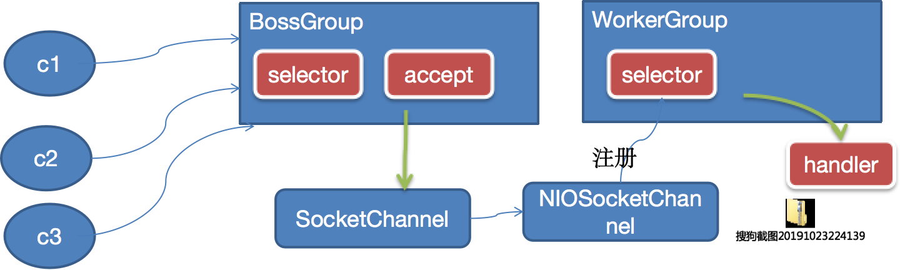

### 5.8.2 对上图说明

1. `BossGroup` 线程维护 `Selector`，只关注 `Accecpt` 
2. 当接收到 `Accept` 事件，获取到对应的 `SocketChannel`，封装成 `NIOScoketChannel` 并注册到 `Worker` 线程（事件循环），并进行维护
3. 当 `Worker` 线程监听到 `Selector` 中通道发生自己感兴趣的事件后，就进行处理（就由 `handler`），注意 `handler` 已经加入到通道

### 5.8.3 工作原理示意图2 - 进阶版

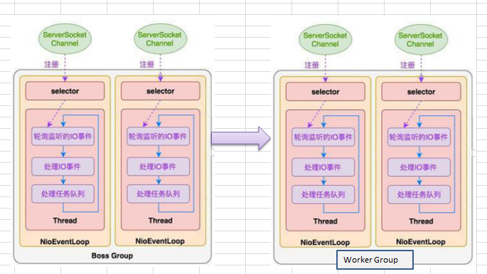

### 5.8.4 工作原理示意图 - 详细版

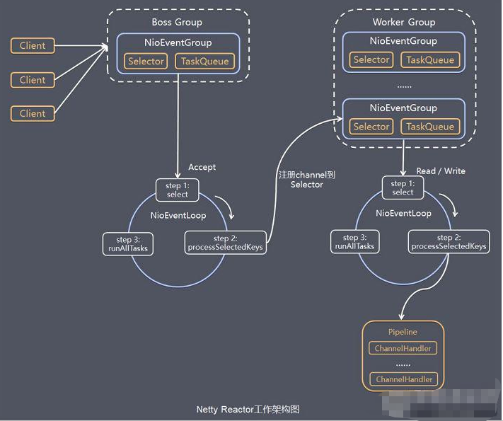

### 5.8.5 对上图的说明小结

1. `Netty` 抽象出两组线程池 `BossGroup` 专门负责接收客户端的连接，`WorkerGroup` 专门负责网络的读写
2. `BossGroup` 和 `WorkerGroup` 类型都是 `NioEventLoopGroup` 
3. `NioEventLoopGroup` 相当于一个事件循环组，这个组中含有多个事件循环，每一个事件循环是 `NioEventLoop` 
4. `NioEventLoop` 表示一个不断循环的执行处理任务的线程，每个 `NioEventLoop` 都有一个 `Selector`，用于监听绑定在其上的 `socket` 的网络通讯
5. `NioEventLoopGroup` 可以有多个线程，即可以含有多个 `NioEventLoop` 
6. 每个 `BossNioEventLoop` 循环执行的步骤有 `3` 步
   - 轮询 `accept` 事件
   - 处理 `accept` 事件，与 `client` 建立连接，生成 `NioScocketChannel`，并将其注册到某个 `worker` `NIOEventLoop` 上的 `Selector`
   - 处理任务队列的任务，即 `runAllTasks`
7. 每个 `Worker` `NIOEventLoop` 循环执行的步骤
   - 轮询 `read`，`write` 事件
   - 处理 `I/O` 事件，即 `read`，`write` 事件，在对应 `NioScocketChannel` 处理
   - 处理任务队列的任务，即 `runAllTasks`
8. 每个 `Worker` `NIOEventLoop` 处理业务时，会使用 `pipeline`（管道），`pipeline` 中包含了 `channel`，即通过 `pipeline` 可以获取到对应通道，管道中维护了很多的处理器


### 5.8.6 Netty 快速入门实例 - TCP 服务

实例要求：使用 `IDEA` 创建 `Netty` 项目

1. `Netty` 服务器在 `6668` 端口监听，客户端能发送消息给服务器"hello,服务器~"
2. 服务器可以回复消息给客户端"hello,客户端~"
3. 目的：对 `Netty` 线程模型有一个初步认识，便于理解 `Netty` 模型理论
4. 看老师代码演示
   5.1 编写服务端   5.2 编写客户端   5.3 对 `netty` 程序进行分析，看看 `netty` 模型特点
   说明：创建 `Maven` 项目，并引入 `Netty` 包
5. 代码如下

```java
NettyServer.java

package com.atguigu.netty.simple;

import io.netty.bootstrap.ServerBootstrap;
import io.netty.channel.ChannelFuture;
import io.netty.channel.ChannelFutureListener;
import io.netty.channel.ChannelInitializer;
import io.netty.channel.ChannelOption;
import io.netty.channel.EventLoopGroup;
import io.netty.channel.nio.NioEventLoopGroup;
import io.netty.channel.socket.SocketChannel;
import io.netty.channel.socket.nio.NioServerSocketChannel;

public class NettyServer {
    
    public static void main(String[] args) throws Exception {
        
        //创建BossGroup 和 WorkerGroup
        //说明
        //1. 创建两个线程组 bossGroup 和 workerGroup
        //2. bossGroup 只是处理连接请求 , 真正的和客户端业务处理，会交给 workerGroup完成
        //3. 两个都是无限循环
        //4. bossGroup 和 workerGroup 含有的子线程(NioEventLoop)的个数
        //   默认实际 cpu核数 * 2
        EventLoopGroup bossGroup = new NioEventLoopGroup(1);
        EventLoopGroup workerGroup = new NioEventLoopGroup(); //8
        
        try {
            //创建服务器端的启动对象，配置参数
            ServerBootstrap bootstrap = new ServerBootstrap();
            //使用链式编程来进行设置
            bootstrap.group(bossGroup, workerGroup) //设置两个线程组
                    .channel(NioServerSocketChannel.class) //使用NioSocketChannel 作为服务器的通道实现
                    .option(ChannelOption.SO_BACKLOG, 128) // 设置线程队列得到连接个数
                    .childOption(ChannelOption.SO_KEEPALIVE, true) //设置保持活动连接状态
            //          .handler(null) // 该 handler对应 bossGroup , childHandler 对应 workerGroup
                    .childHandler(new ChannelInitializer<SocketChannel>() {//创建一个通道初始化对象(匿名对象)
                        //给pipeline 设置处理器
                        @Override
                        protected void initChannel(SocketChannel ch) throws Exception {
                            System.out.println("客户socketchannel hashcode=" + ch.hashCode()); //可以使用一个集合管理 SocketChannel， 再推送消息时，可以将业务加入到各个channel 对应的 NIOEventLoop 的 taskQueue 或者 scheduleTaskQueue
                            ch.pipeline().addLast(new NettyServerHandler());
                        }
                    }); // 给我们的workerGroup 的 EventLoop 对应的管道设置处理器

            System.out.println(".....服务器 is ready...");

            //绑定一个端口并且同步, 生成了一个 ChannelFuture 对象
            //启动服务器(并绑定端口)
            ChannelFuture cf = bootstrap.bind(6668).sync();

            //给cf 注册监听器，监控我们关心的事件

            cf.addListener(new ChannelFutureListener() {
                @Override
                public void operationComplete(ChannelFuture future) throws Exception {
                    if (cf.isSuccess()) {
                        System.out.println("监听端口 6668 成功");
                    } else {
                        System.out.println("监听端口 6668 失败");
                    }
                }
            });

            //对关闭通道进行监听
            cf.channel().closeFuture().sync();
        }finally {
            bossGroup.shutdownGracefully();
            workerGroup.shutdownGracefully();
        }
    }
}

NettyServerHandler.java

package com.atguigu.netty.simple;

import io.netty.buffer.ByteBuf;
import io.netty.buffer.Unpooled;
import io.netty.channel.Channel;
import io.netty.channel.ChannelHandlerContext;
import io.netty.channel.ChannelInboundHandlerAdapter;
import io.netty.channel.ChannelPipeline;
import io.netty.util.CharsetUtil;

/**
 * 说明
 * 1. 我们自定义一个Handler 需要继续netty 规定好的某个HandlerAdapter(规范)
 * 2. 这时我们自定义一个Handler , 才能称为一个handler
 */
public class NettyServerHandler extends ChannelInboundHandlerAdapter {

    //读取数据实际(这里我们可以读取客户端发送的消息)
    /**
     * 1. ChannelHandlerContext ctx:上下文对象, 含有 管道pipeline , 通道channel, 地址
     * 2. Object msg: 就是客户端发送的数据 默认Object
     */
    @Override
    public void channelRead(ChannelHandlerContext ctx, Object msg) throws Exception {
        
        System.out.println("服务器读取线程 " + Thread.currentThread().getName() + " channle =" + ctx.channel());
        System.out.println("server ctx =" + ctx);
        System.out.println("看看channel 和 pipeline的关系");
        Channel channel = ctx.channel();
        ChannelPipeline pipeline = ctx.pipeline(); //本质是一个双向链接, 出站入站
        
        //将 msg 转成一个 ByteBuf
        //ByteBuf 是 Netty 提供的，不是 NIO 的 ByteBuffer.
        ByteBuf buf = (ByteBuf) msg;
        System.out.println("客户端发送消息是:" + buf.toString(CharsetUtil.UTF_8));
        System.out.println("客户端地址:" + channel.remoteAddress());
    }

    //数据读取完毕
    @Override
    public void channelReadComplete(ChannelHandlerContext ctx) throws Exception {
        //writeAndFlush 是 write + flush
        //将数据写入到缓存，并刷新
        //一般讲，我们对这个发送的数据进行编码
        ctx.writeAndFlush(Unpooled.copiedBuffer("hello, 客户端~(>^ω^<)喵1", CharsetUtil.UTF_8));
    }
    
    //处理异常, 一般是需要关闭通道
    @Override
    public void exceptionCaught(ChannelHandlerContext ctx, Throwable cause) throws Exception {
        ctx.close();
    }
}

NettyClient.java

package com.atguigu.netty.simple;

import io.netty.bootstrap.Bootstrap;
import io.netty.channel.ChannelFuture;
import io.netty.channel.ChannelInitializer;
import io.netty.channel.EventLoopGroup;
import io.netty.channel.nio.NioEventLoopGroup;
import io.netty.channel.socket.SocketChannel;
import io.netty.channel.socket.nio.NioSocketChannel;

public class NettyClient {
    
    public static void main(String[] args) throws Exception {

        //客户端需要一个事件循环组
        EventLoopGroup group = new NioEventLoopGroup();
        try {
            
            //创建客户端启动对象
            //注意客户端使用的不是 ServerBootstrap 而是 Bootstrap
            Bootstrap bootstrap = new Bootstrap();
            //设置相关参数
            bootstrap.group(group) //设置线程组
                    .channel(NioSocketChannel.class) // 设置客户端通道的实现类(反射)
                    .handler(new ChannelInitializer<SocketChannel>() {
                        @Override
                        protected void initChannel(SocketChannel ch) throws Exception {
                            ch.pipeline().addLast(new NettyClientHandler()); //加入自己的处理器
                        }
                    });
            
            System.out.println("客户端 ok..");
            //启动客户端去连接服务器端
            //关于 ChannelFuture 要分析，涉及到netty的异步模型
            ChannelFuture channelFuture = bootstrap.connect("127.0.0.1", 6668).sync();
            //给关闭通道进行监听
            channelFuture.channel().closeFuture().sync();
        } finally {
            group.shutdownGracefully();
        }
    }
}

NettyClientHandler.java

package com.atguigu.netty.simple;

import io.netty.buffer.ByteBuf;
import io.netty.buffer.Unpooled;
import io.netty.channel.ChannelHandlerContext;
import io.netty.channel.ChannelInboundHandlerAdapter;
import io.netty.util.CharsetUtil;

public class NettyClientHandler extends ChannelInboundHandlerAdapter {
    
    //当通道就绪就会触发该方法
    @Override
    public void channelActive(ChannelHandlerContext ctx) throws Exception {
        System.out.println("client " + ctx);
        ctx.writeAndFlush(Unpooled.copiedBuffer("hello, server: (>^ω^<)喵", CharsetUtil.UTF_8));
    }

    //当通道有读取事件时，会触发
    @Override
    public void channelRead(ChannelHandlerContext ctx, Object msg) throws Exception {
        ByteBuf buf = (ByteBuf) msg;
        System.out.println("服务器回复的消息:" + buf.toString(CharsetUtil.UTF_8));
        System.out.println("服务器的地址： " + ctx.channel().remoteAddress());
    }

    @Override
    public void exceptionCaught(ChannelHandlerContext ctx, Throwable cause) throws Exception {
        cause.printStackTrace();
        ctx.close();
    }
}
```

### 5.8.7 任务队列中的 Task 有 3 种典型使用场景

1. 用户程序自定义的普通任务【举例说明】
2. 用户自定义定时任务
3. 非当前 `Reactor` 线程调用 `Channel` 的各种方法
   例如在推送系统的业务线程里面，根据用户的标识，找到对应的 `Channel` 引用，然后调用 `Write` 类方法向该用户推送消息，就会进入到这种场景。最终的 `Write` 会提交到任务队列中后被异步消费
4. 代码演示

```java
package com.atguigu.netty.simple;

import io.netty.buffer.Unpooled;
import io.netty.channel.ChannelHandlerContext;
import io.netty.channel.ChannelInboundHandlerAdapter;
import io.netty.util.CharsetUtil;

import java.util.concurrent.TimeUnit;

/**
 * 说明
 * 1. 我们自定义一个Handler 需要继续netty 规定好的某个HandlerAdapter(规范)
 * 2. 这时我们自定义一个Handler , 才能称为一个handler
 */
public class NettyServerHandler extends ChannelInboundHandlerAdapter {

    //读取数据实际(这里我们可以读取客户端发送的消息)

    /**
     * 1. ChannelHandlerContext ctx:上下文对象, 含有 管道pipeline , 通道channel, 地址
     * 2. Object msg: 就是客户端发送的数据 默认Object
     */
    @Override
    public void channelRead(ChannelHandlerContext ctx, Object msg) throws Exception {

        // 比如这里我们有一个非常耗时长的业务-> 异步执行 -> 提交该channel 对应的
        // NIOEventLoop 的 taskQueue中,

        // 解决方案1 用户程序自定义的普通任务

        ctx.channel().eventLoop().execute(new Runnable() {
            @Override
            public void run() {

                try {
                    Thread.sleep(5 * 1000);
                    ctx.writeAndFlush(Unpooled.copiedBuffer("hello, 客户端~(>^ω^<)喵2", CharsetUtil.UTF_8));
                    System.out.println("channel code=" + ctx.channel().hashCode());
                } catch (Exception ex) {
                    System.out.println("发生异常" + ex.getMessage());
                }
            }
        });

        ctx.channel().eventLoop().execute(new Runnable() {
            @Override
            public void run() {

                try {
                    Thread.sleep(5 * 1000);
                    ctx.writeAndFlush(Unpooled.copiedBuffer("hello, 客户端~(>^ω^<)喵3", CharsetUtil.UTF_8));
                    System.out.println("channel code=" + ctx.channel().hashCode());
                } catch (Exception ex) {
                    System.out.println("发生异常" + ex.getMessage());
                }
            }
        });

        //解决方案2 : 用户自定义定时任务 -》 该任务是提交到 scheduleTaskQueue中

        ctx.channel().eventLoop().schedule(new Runnable() {
            @Override
            public void run() {

                try {
                    Thread.sleep(5 * 1000);
                    ctx.writeAndFlush(Unpooled.copiedBuffer("hello, 客户端~(>^ω^<)喵4", CharsetUtil.UTF_8));
                    System.out.println("channel code=" + ctx.channel().hashCode());
                } catch (Exception ex) {
                    System.out.println("发生异常" + ex.getMessage());
                }
            }
        }, 5, TimeUnit.SECONDS);

        System.out.println("go on ...");

//        System.out.println("服务器读取线程 " + Thread.currentThread().getName() + " channle =" + ctx.channel());
//        System.out.println("server ctx =" + ctx);
//        System.out.println("看看channel 和 pipeline的关系");
//        Channel channel = ctx.channel();
//        ChannelPipeline pipeline = ctx.pipeline(); //本质是一个双向链接, 出站入站
//        
//        //将 msg 转成一个 ByteBuf
//        //ByteBuf 是 Netty 提供的，不是 NIO 的 ByteBuffer.
//        ByteBuf buf = (ByteBuf) msg;
//        System.out.println("客户端发送消息是:" + buf.toString(CharsetUtil.UTF_8));
//        System.out.println("客户端地址:" + channel.remoteAddress());
    }

    //数据读取完毕
    @Override
    public void channelReadComplete(ChannelHandlerContext ctx) throws Exception {
        //writeAndFlush 是 write + flush
        //将数据写入到缓存，并刷新
        //一般讲，我们对这个发送的数据进行编码
        ctx.writeAndFlush(Unpooled.copiedBuffer("hello, 客户端~(>^ω^<)喵1", CharsetUtil.UTF_8));
    }

    //处理异常, 一般是需要关闭通道
    @Override
    public void exceptionCaught(ChannelHandlerContext ctx, Throwable cause) throws Exception {
        ctx.close();
    }
}
```

### 5.8.8 方案再说明

1. `Netty` 抽象出两组线程池，`BossGroup` 专门负责接收客户端连接，`WorkerGroup` 专门负责网络读写操作。
2. `NioEventLoop` 表示一个不断循环执行处理任务的线程，每个 `NioEventLoop` 都有一个 `Selector`，用于监听绑定在其上的 `socket`网络通道。
3. `NioEventLoop` 内部采用串行化设计，从消息的 **读取->解码->处理->编码->发送**，始终由 `IO` 线程 `NioEventLoop` 负责

`NioEventLoopGroup` 下包含多个 `NioEventLoop`
- 每个 `NioEventLoop` 中包含有一个 `Selector`，一个 `taskQueue`
- 每个 `NioEventLoop` 的 `Selector` 上可以注册监听多个 `NioChannel`
- 每个 `NioChannel` 只会绑定在唯一的 `NioEventLoop` 上
- 每个 `NioChannel` 都绑定有一个自己的 `ChannelPipeline`

## 5.9 异步模型

### 5.9.1 基本介绍

1. 异步的概念和同步相对。当一个异步过程调用发出后，调用者不能立刻得到结果。实际处理这个调用的组件在完成后，通过状态、通知和回调来通知调用者。
2. `Netty` 中的 `I/O` 操作是异步的，包括 `Bind、Write、Connect` 等操作会简单的返回一个 `ChannelFuture`。
3. 调用者并不能立刻获得结果，而是通过 `Future-Listener` 机制，用户可以方便的主动获取或者通过通知机制获得 `IO` 操作结果。
4. `Netty` 的异步模型是建立在 `future` 和 `callback` 的之上的。`callback` 就是回调。重点说 `Future`，它的核心思想是：假设一个方法 `fun`，计算过程可能非常耗时，等待 `fun` 返回显然不合适。那么可以在调用 `fun` 的时候，立马返回一个 `Future`，后续可以通过 `Future` 去监控方法 `fun` 的处理过程（即：`Future-Listener` 机制）

### 5.9.2 Future 说明

1. 表示异步的执行结果,可以通过它提供的方法来检测执行是否完成，比如检索计算等等。
2. `ChannelFuture` 是一个接口：`public interface ChannelFuture extends Future<Void>` 我们可以添加监听器，当监听的事件发生时，就会通知到监听器。案例说明

### 5.9.3 工作原理示意图

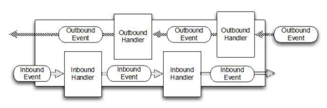

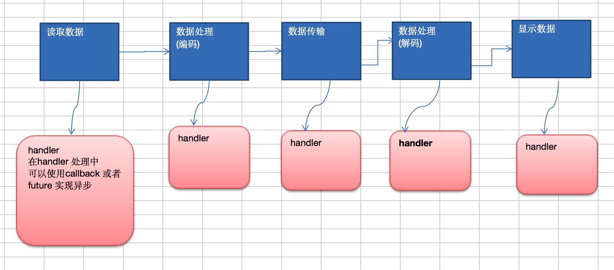

说明：
1. 在使用 `Netty` 进行编程时，拦截操作和转换出入站数据只需要您提供 `callback` 或利用 `future` 即可。这使得链式操作简单、高效，并有利于编写可重用的、通用的代码。
2. `Netty` 框架的目标就是让你的业务逻辑从网络基础应用编码中分离出来、解脱出来。

### 5.9.4 Future-Listener 机制

1. 当 `Future` 对象刚刚创建时，处于非完成状态，调用者可以通过返回的 `ChannelFuture` 来获取操作执行的状态，注册监听函数来执行完成后的操作。
2. 常见有如下操作
   - 通过 `isDone` 方法来判断当前操作是否完成；
   - 通过 `isSuccess` 方法来判断已完成的当前操作是否成功；
   - 通过 `getCause` 方法来获取已完成的当前操作失败的原因；
   - 通过 `isCancelled` 方法来判断已完成的当前操作是否被取消；
   - 通过 `addListener` 方法来注册监听器，当操作已完成（`isDone`方法返回完成），将会通知指定的监听器；如果 `Future` 对象已完成，则通知指定的监听器

举例说明
演示：绑定端口是异步操作，当绑定操作处理完，将会调用相应的监听器处理逻辑

```java
//绑定一个端口并且同步,生成了一个ChannelFuture对象
//启动服务器(并绑定端口)
ChannelFuture cf = bootstrap.bind(6668).sync();
//给cf注册监听器，监控我们关心的事件
cf.addListener(new ChannelFutureListener() {
   @Override
   public void operationComplete (ChannelFuture future) throws Exception {
      if (cf.isSuccess()) {
         System.out.println("监听端口6668成功");
      } else {
         System.out.println("监听端口6668失败");
      }
   }
});
```

## 5.10 快速入门实例 - HTTP服务

1. 实例要求：使用 `IDEA` 创建 `Netty` 项目
2. `Netty` 服务器在 `6668` 端口监听，浏览器发出请求 `http://localhost:6668/` 
3. 服务器可以回复消息给客户端"Hello!我是服务器5",并对特定请求资源进行过滤。
4. 目的：`Netty` 可以做 `Http` 服务开发，并且理解 `Handler` 实例和客户端及其请求的关系。
5. 看老师代码演示

```java
TestServer.java

package com.atguigu.netty.http;

import io.netty.bootstrap.ServerBootstrap;
import io.netty.channel.ChannelFuture;
import io.netty.channel.EventLoopGroup;
import io.netty.channel.nio.NioEventLoopGroup;
import io.netty.channel.socket.nio.NioServerSocketChannel;

public class TestServer {
    
    public static void main(String[] args) throws Exception {

        EventLoopGroup bossGroup = new NioEventLoopGroup(1);
        EventLoopGroup workerGroup = new NioEventLoopGroup();

        try {
            ServerBootstrap serverBootstrap = new ServerBootstrap();

            serverBootstrap.group(bossGroup, workerGroup).channel(NioServerSocketChannel.class).childHandler(new TestServerInitializer());

            ChannelFuture channelFuture = serverBootstrap.bind(6668).sync();

            channelFuture.channel().closeFuture().sync();

        } finally {
            bossGroup.shutdownGracefully();
            workerGroup.shutdownGracefully();
        }
    }
}

TestServerInitializer.java

package com.atguigu.netty.http;

import io.netty.channel.ChannelInitializer;
import io.netty.channel.ChannelPipeline;
import io.netty.channel.socket.SocketChannel;
import io.netty.handler.codec.http.HttpServerCodec;

public class TestServerInitializer extends ChannelInitializer<SocketChannel> {

    @Override
    protected void initChannel(SocketChannel ch) throws Exception {

        //向管道加入处理器

        //得到管道
        ChannelPipeline pipeline = ch.pipeline();

        //加入一个netty 提供的httpServerCodec codec =>[coder - decoder]
        //HttpServerCodec 说明
        //1. HttpServerCodec 是netty 提供的处理http的 编-解码器
        pipeline.addLast("MyHttpServerCodec", new HttpServerCodec());
        //2. 增加一个自定义的handler
        pipeline.addLast("MyTestHttpServerHandler", new TestHttpServerHandler());

        System.out.println("ok~~~~");
    }
}

TestHttpServerHandler.java

package com.atguigu.netty.http;

import io.netty.buffer.ByteBuf;
import io.netty.buffer.Unpooled;
import io.netty.channel.ChannelHandlerContext;
import io.netty.channel.SimpleChannelInboundHandler;
import io.netty.handler.codec.http.*;
import io.netty.util.CharsetUtil;

import java.net.URI;

/**
 * 说明
 * 1. SimpleChannelInboundHandler 是 ChannelInboundHandlerAdapter
 * 2. HttpObject 客户端和服务器端相互通讯的数据被封装成 HttpObject
 */
public class TestHttpServerHandler extends SimpleChannelInboundHandler<HttpObject> {

    //channelRead0 读取客户端数据
    @Override
    protected void channelRead0(ChannelHandlerContext ctx, HttpObject msg) throws Exception {

        System.out.println("对应的channel=" + ctx.channel() + " pipeline=" + ctx
                .pipeline() + " 通过pipeline获取channel" + ctx.pipeline().channel());

        System.out.println("当前ctx的handler=" + ctx.handler());

        //判断 msg 是不是 httprequest请求
        if (msg instanceof HttpRequest) {

            System.out.println("ctx 类型=" + ctx.getClass());

            System.out.println("pipeline hashcode" + ctx.pipeline().hashCode() + " TestHttpServerHandler hash=" + this.hashCode());

            System.out.println("msg 类型=" + msg.getClass());
            System.out.println("客户端地址" + ctx.channel().remoteAddress());

            //获取到
            HttpRequest httpRequest = (HttpRequest) msg;
            //获取uri, 过滤指定的资源
            URI uri = new URI(httpRequest.uri());
            if ("/favicon.ico".equals(uri.getPath())) {
                System.out.println("请求了 favicon.ico, 不做响应");
                return;
            }
            //回复信息给浏览器 [http协议]

            ByteBuf content = Unpooled.copiedBuffer("hello, 我是服务器", CharsetUtil.UTF_8);

            //构造一个http的相应，即 httpresponse
            FullHttpResponse response = new DefaultFullHttpResponse(HttpVersion.HTTP_1_1, HttpResponseStatus.OK, content);

            response.headers().set(HttpHeaderNames.CONTENT_TYPE, "text/plain");
            response.headers().set(HttpHeaderNames.CONTENT_LENGTH, content.readableBytes());

            //将构建好 response返回
            ctx.writeAndFlush(response);

        }
    }
}
```
