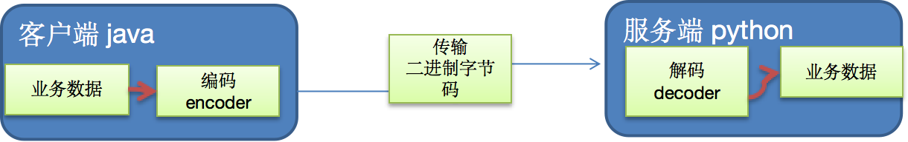
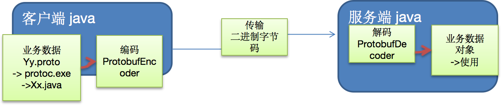

## 7.1 编码和解码的基本介绍

1. 编写网络应用程序时，因为数据在网络中传输的都是二进制字节码数据，在发送数据时就需要编码，接收数据时就需要解码[示意图]
2. `codec`（编解码器）的组成部分有两个：`decoder`（解码器）和 `encoder`（编码器）。`encoder` 负责把业务数据转换成字节码数据，`decoder` 负责把字节码数据转换成业务数据



## 7.2 Netty 本身的编码解码的机制和问题分析

1. `Netty` 自身提供了一些 `codec`(编解码器)
2. `Netty` 提供的编码器 `StringEncoder`，对字符串数据进行编码 `ObjectEncoder`，对Java对象进行编码...
3. `Netty` 提供的解码器 `StringDecoder`,对字符串数据进行解码 `ObjectDecoder`，对 `Java` 对象进行解码...
4. `Netty` 本身自带的 `ObjectDecoder` 和 `ObjectEncoder` 可以用来实现 `POJO` 对象或各种业务对象的编码和解码，底层使用的仍是Java序列化技术,而Java序列化技术本身效率就不高，存在如下问题
   - 无法跨语言
   - 序列化后的体积太大，是二进制编码的5倍多。
   - 序列化性能太低

5. =>引出新的解决方案[`Google` 的 `Protobuf`]

## 7.3 Protobuf

1. `Protobuf` 基本介绍和使用示意图
2. `Protobuf` 是 `Google` 发布的开源项目，全称 `Google Protocol Buffers`，是一种轻便高效的结构化数据存储格式，可以用于结构化数据串行化，或者说序列化。它很适合做数据存储或 `RPC` [远程过程调用 `remote procedure call` ]数据交换格式。目前很多公司 `http + json tcp + protobuf`
3. 参考文档：https://developers.google.com/protocol-buffers/docs/proto 语言指南
4. `Protobuf` 是以 `message` 的方式来管理数据的.
5. 支持跨平台、跨语言，即[客户端和服务器端可以是不同的语言编写的]（支持目前绝大多数语言，例如 `C++`、`C#`、`Java`、`python` 等）
6. 高性能，高可靠性
7. 使用 `protobuf` 编译器能自动生成代码，`Protobuf` 是将类的定义使用 `.proto` 文件进行描述。说明，在 `idea` 中编写 `.proto` 文件时，会自动提示是否下载 `.ptoto` 编写插件.可以让语法高亮。
8. 然后通过 `protoc.exe` 编译器根据 `.proto` 自动生成 `.java` 文件
9. `protobuf` 使用示意图



## 7.4 Protobuf 快速入门实例

编写程序，使用 `Protobuf` 完成如下功能

1. 客户端可以发送一个 `StudentPoJo` 对象到服务器(通过 `Protobuf` 编码)
2. 服务端能接收 `StudentPoJo` 对象，并显示信息(通过 `Protobuf` 解码)
3. 具体看老师演示步骤

```java
Student.proto

syntax = "proto3"; //版本
option java_outer_classname = "StudentPOJO";//生成的外部类名，同时也是文件名
//protobuf 使用message 管理数据
message Student { //会在 StudentPOJO 外部类生成一个内部类 Student， 他是真正发送的POJO对象
    int32 id = 1; // Student 类中有 一个属性 名字为 id 类型为int32(protobuf类型) 1表示属性序号，不是值
    string name = 2;
}

编译
protoc.exe--java_out=.Student.proto
将生成的 StudentPOJO 放入到项目使用
```

## 7.5 Protobuf 快速入门实例 2

1. 编写程序，使用 `Protobuf` 完成如下功能
2. 客户端可以随机发送 `StudentPoJo` / `WorkerPoJo` 对象到服务器(通过 `Protobuf` 编码)
3. 服务端能接收 `StudentPoJo` / `WorkerPoJo` 对象(需要判断是哪种类型)，并显示信息(通过 `Protobuf` 解码)
4. 具体看老师演示步骤

```java
Student.proto

syntax = "proto3";
option optimize_for = SPEED; // 加快解析
option java_package="com.atguigu.netty.codec2";   //指定生成到哪个包下
option java_outer_classname="MyDataInfo"; // 外部类名, 文件名

//protobuf 可以使用message 管理其他的message
message MyMessage {

    //定义一个枚举类型
    enum DataType {
        StudentType = 0; //在proto3 要求enum的编号从0开始
        WorkerType = 1;
    }

    //用data_type 来标识传的是哪一个枚举类型
    DataType data_type = 1;

    //表示每次枚举类型最多只能出现其中的一个, 节省空间
    oneof dataBody {
        Student student = 2;
        Worker worker = 3;
    }

}


message Student {
    int32 id = 1;//Student类的属性
    string name = 2; //
}
message Worker {
    string name=1;
    int32 age=2;
}
```