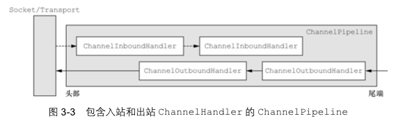
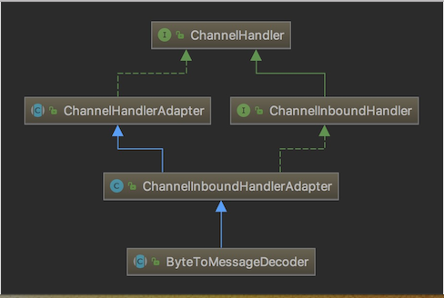
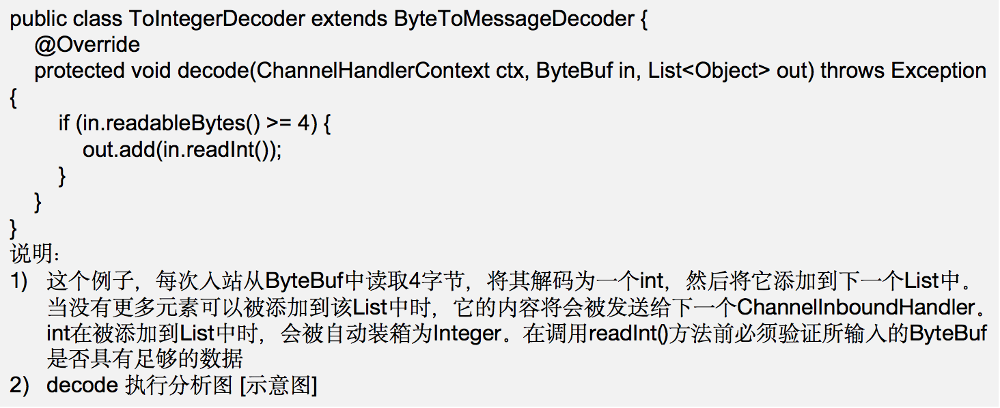
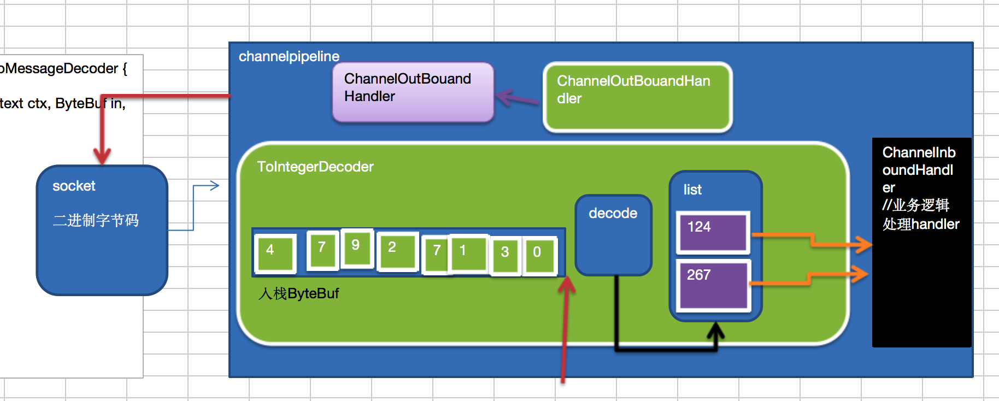
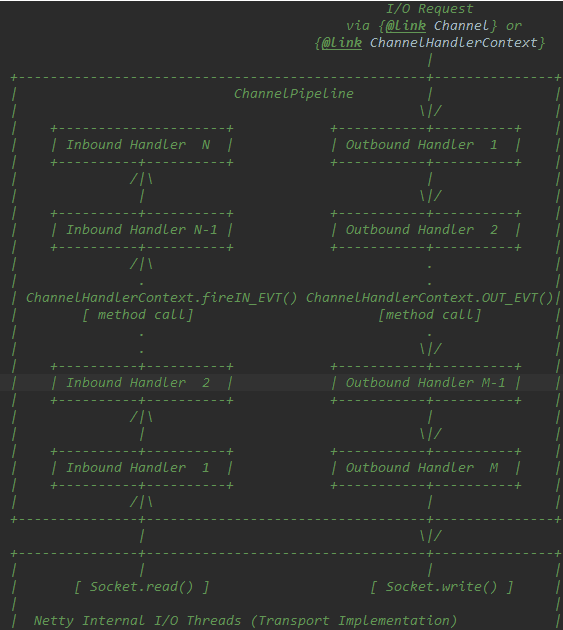
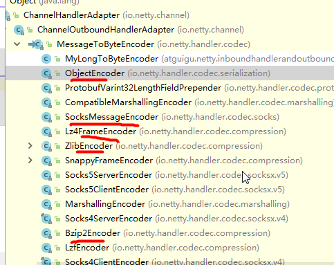
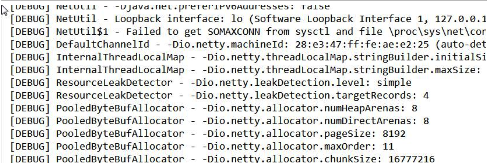

## 8.1 基本说明

1. `Netty` 的组件设计：`Netty` 的主要组件有 `Channel`、`EventLoop`、`ChannelFuture`、`ChannelHandler`、`ChannelPipe` 等
2. `ChannelHandler` 充当了处理入站和出站数据的应用程序逻辑的容器。例如，实现 `ChannelInboundHandler` 接口（或 `ChannelInboundHandlerAdapter`），你就可以接收入站事件和数据，这些数据会被业务逻辑处理。当要给客户端发送响应时，也可以从 `ChannelInboundHandler` 冲刷数据。业务逻辑通常写在一个或者多个 `ChannelInboundHandler` 中。`ChannelOutboundHandler` 原理一样，只不过它是用来处理出站数据的
3. `ChannelPipeline` 提供了 `ChannelHandler` 链的容器。以客户端应用程序为例，如果事件的运动方向是从客户端到服务端的，那么我们称这些事件为出站的，即客户端发送给服务端的数据会通过 `pipeline` 中的一系列 `ChannelOutboundHandler`，并被这些 `Handler` 处理，反之则称为入站的



## 8.2编码解码器

1. 当 `Netty` 发送或者接受一个消息的时候，就将会发生一次数据转换。入站消息会被解码：从字节转换为另一种格式（比如 `java` 对象）；如果是出站消息，它会被编码成字节。
2. `Netty` 提供一系列实用的编解码器，他们都实现了 `ChannelInboundHadnler` 或者 `ChannelOutboundHandler` 接口。在这些类中，`channelRead` 方法已经被重写了。以入站为例，对于每个从入站 `Channel` 读取的消息，这个方法会被调用。随后，它将调用由解码器所提供的 `decode()` 方法进行解码，并将已经解码的字节转发给 `ChannelPipeline` 中的下一个 `ChannelInboundHandler`。

## 8.3 解码器 - ByteToMessageDecoder

1. 关系继承图



2. 由于不可能知道远程节点是否会一次性发送一个完整的信息，`tcp` 有可能出现粘包拆包的问题，这个类会对入站数据进行缓冲，直到它准备好被处理.
3. 一个关于 `ByteToMessageDecoder` 实例分析





## 8.4 Netty 的 handler 链的调用机制

实例要求:

1. 使用自定义的编码器和解码器来说明 `Netty` 的 `handler` 调用机制
   客户端发送 `long` -> 服务器
   服务端发送 `long` -> 客户端
2. 案例演示



3. 结论
   - 不论解码器 `handler` 还是编码器 `handler` 即接收的消息类型必须与待处理的消息类型一致，否则该 `handler` 不会被执行
   - 在解码器进行数据解码时，需要判断缓存区（`ByteBuf`）的数据是否足够，否则接收到的结果会期望结果可能不一致

## 8.5 解码器 - ReplayingDecoder

1. `public abstract class ReplayingDecoder<S> extends ByteToMessageDecoder`
2. `ReplayingDecoder` 扩展了 `ByteToMessageDecoder` 类，使用这个类，我们不必调用 `readableBytes()` 方法。参数 `S` 指定了用户状态管理的类型，其中 `Void` 代表不需要状态管理
3. 应用实例：使用 `ReplayingDecoder` 编写解码器，对前面的案例进行简化[案例演示]

```java
package com.atguigu.netty.inboundhandlerandoutboundhandler;

import io.netty.buffer.ByteBuf;
import io.netty.channel.ChannelHandlerContext;
import io.netty.handler.codec.ReplayingDecoder;

import java.util.List;

public class MyByteToLongDecoder2 extends ReplayingDecoder<Void> {
    
    @Override
    protected void decode(ChannelHandlerContext ctx, ByteBuf in, List<Object> out) throws Exception {
        System.out.println("MyByteToLongDecoder2 被调用");
        //在 ReplayingDecoder 不需要判断数据是否足够读取，内部会进行处理判断
        out.add(in.readLong());
    }
}
```

4. `ReplayingDecoder` 使用方便，但它也有一些局限性：
   - 并不是所有的 `ByteBuf` 操作都被支持，如果调用了一个不被支持的方法，将会抛出一个 `UnsupportedOperationException`。
   - `ReplayingDecoder` 在某些情况下可能稍慢于 `ByteToMessageDecoder`，例如网络缓慢并且消息格式复杂时，消息会被拆成了多个碎片，速度变慢

## 8.6 其它编解码器



### 8.6.1 其它解码器

1. `LineBasedFrameDecoder`：这个类在 `Netty` 内部也有使用，它使用行尾控制字符（\n或者\r\n）作为分隔符来解析数据。
2. `DelimiterBasedFrameDecoder`：使用自定义的特殊字符作为消息的分隔符。
3. `HttpObjectDecoder`：一个 `HTTP` 数据的解码器
4. `LengthFieldBasedFrameDecoder`：通过指定长度来标识整包消息，这样就可以自动的处理黏包和半包消息。

### 8.6.2 其它编码器

## 8.7 Log4j 整合到 Netty

1. 在 `Maven` 中添加对 `Log4j` 的依赖在 `pom.xml`

```xml
<dependency>
    <groupId>log4j</groupId>
    <artifactId>log4j</artifactId>
    <version>1.2.17</version>
</dependency>
<dependency>
    <groupId>org.slf4j</groupId>
    <artifactId>slf4j-api</artifactId>
    <version>1.7.25</version>
</dependency>
<dependency>
    <groupId>org.slf4j</groupId>
    <artifactId>slf4j-log4j12</artifactId>
    <version>1.7.25</version>
    <scope>test</scope>
</dependency>
<dependency>
    <groupId>org.slf4j</groupId>
    <artifactId>slf4j-simple</artifactId>
    <version>1.7.25</version>
    <scope>test</scope>
</dependency>
```

2. 配置 `Log4j`，在 `resources/log4j.properties`

```xml
log4j.rootLogger=DEBUG,stdout
log4j.appender.stdout=org.apache.log4j.ConsoleAppender
log4j.appender.stdout.layout=org.apache.log4j.PatternLayout
log4j.appender.stdout.layout.ConversionPattern=[%p]%C{1}-%m%n
```

3. 演示整合



